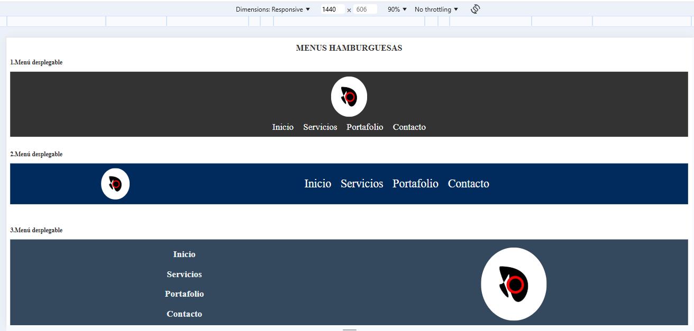
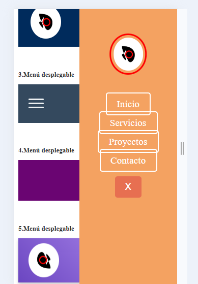

# Menú Hamburguesa Responsive

Este proyecto incluye múltiples diseños de **menús hamburguesa responsive** creados con HTML, CSS y JavaScript, diseñados para adaptarse a diferentes tamaños de pantalla con estilos modernos y funcionales.

## Características

- **Responsive Design:** Compatible con pantallas pequeñas y grandes.
- **Interactividad Dinámica:** Uso de JavaScript para control de menús.
- **Estilo Moderno:** Diseños con animaciones y paletas de colores creativas.
- **Elementos Visuales:** Incluye logos e iconos animados.

## Vista Previa

### Pantallas Grandes

### Pantallas Pequeñas

